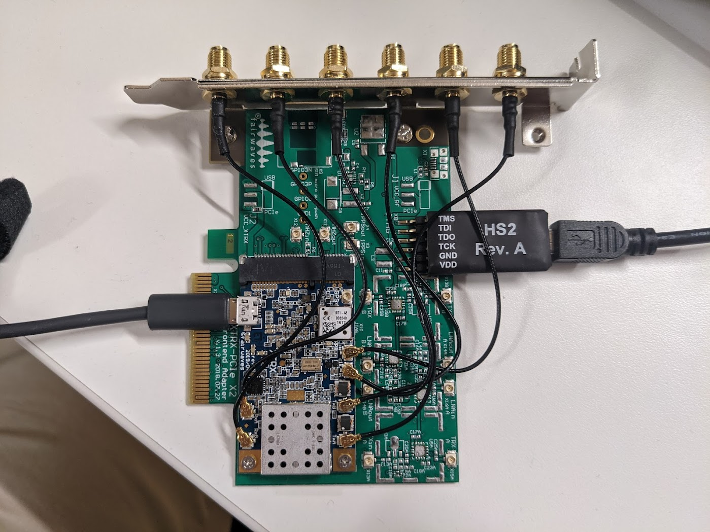

                               _  ___________  _  __       __     ___
                              | |/_/_  __/ _ \| |/_/_____ / /_ __/ (_)__ _
                             _>  <  / / / , _/>  </___/ // / // / / / _ `/
                            /_/|_|_/_/ /_/|_/_/|_|    \___/\_,_/_/_/\_,_/
                             / ___/__  __ _  ___  __ __/ /___ _____  ___ _
                            / /__/ _ \/  ' \/ _ \/ // / __/ // / _ \/ _ `/
                            \___/\___/_/_/_/ .__/\_,_/\__/\_,_/_//_/\_, /
                                          /_/                      /___/
                                XTRX LiteX/LitePCIe based FPGA design
                                      for Julia Computing.

[> Intro
--------

This project aims to recreate a FPGA design for the XTRX board with
LiteX/LitePCIe:


This Julia Computing remote contains support for GPU P2P operations.

[> GPU Setup
------------

For P2P operation the [open source Nvidia drivers](https://github.com/NVIDIA/open-gpu-kernel-modules) are required.
Note that we currently carry [our own patch for resizing the addressable memory space](https://github.com/NVIDIA/open-gpu-kernel-modules/pull/3), and until that is merged, the easiest thing to do is to build our fork of the driver, which can be done via `make -C software nvidia-driver`.


[> Getting started
------------------

### [> Hardware
- XTRX (Rev4 and 5, pro and non-pro variants all supported)
- XTRX PCIE Carrier board (to access JTAG)
- JTAG HS2 programmer from Digilent

### [> Initialize Git submodules:

Git submodules are used to track various upstream software sources.
From a clean clone, one can initialize by:

```
git submodule init
git submodule update
```

### [> Installing LiteX:

LiteX can be installed by following the installation instructions from the LiteX
Wiki: https://github.com/enjoy-digital/litex/wiki/Installation

The latest master branch of the LiteX sources is preferrable,
though regressions and API changes are possible.

To use a known-good LiteX version the following script can set the
appropriate git checkouts:

```
./apply_litex_manifest.sh path/to/litex
```

### [> Installing the RISC-V toolchain for the Soft-CPU:

To get and install a RISC-V toolchain, please install it manually of follow the
LiteX's wiki: https://github.com/enjoy-digital/litex/wiki/Installation:

```
./litex_setup.py --gcc=riscv
```


[> Build and Test the design
----------------------------



The gateware supports rev4/rev5 and pro/non-pro variants of the XTRX board.
The differences between rev4 and rev5 are detected and handled by the embedded
firmware running on the VexRISC core, so no gateware configuration is required.

However, for pro and non-pro variants a configuration is required, see below.

In addition the PCIe bus width defaults to 64 Bit. For a single device,
32 bits is sufficent and preferred.

Example: Build the design and flash it to the board (Pro, 64 bit PCIe width):

```
./fairwaves_xtrx.py --build --flash
```

Example: Build the design and flash it to the board (Non-Pro, 32 bit PCIe width):

```
./fairwaves_xtrx.py --build --flash --nonpro --address_width=32
```

This will program over JTAG. On linux you will need to set the appropriate udev rules.
Sometimes when migrating from the original XTRX gateware it is required to power over the
USB on the XTRX, rather than PCIe (as shown in the picture above).

Build the Linux kernel driver and load it.
Note that by default, the current live kernel will be built against, but you can cross-compile for a target kernel version by setting `USE_LIVE_KERNEL=false`.

```
make -C software litepcie-kernel-module
sudo software/litepcie-kernel-module/init.sh
```

CUDA support can be disabled by commenting out the following line: https://github.com/JuliaComputing/xtrx_julia/blob/b448549ee128956e6066afbb3e1ee69e895737c5/software/litepcie-kernel-module/main.c#L43

Note that if a thunderbolt carrier is in use, it may be necessary rescan the pci bus:

```
sudo bash -c 'echo "1" > /sys/bus/pci/rescan'
```

Build the Linux user-space utilities and test them:

```
make -C software litepcie-user-library -j$(nproc)
cd build/litepcie-user-library
./litepcie_util info
./litepcie_util scratch_test
./litepcie_util dma_test
```

For builds without an NVIDIA GPU:

```
make -C software litepcie-user-library -j$(nproc) USE_CUDA=false
```

If anything goes wrong, reset the device with:

```
sudo ./test/reset.sh
```


[> User-space software
----------------------

To interface with the LMS7002M chip, we provide SoapySDR drivers.
One driver is built on top of [MyriadRF's LMS7002M driver
library](https://github.com/myriadrf/LMS7002M-driver), which is downloaded and
installed automatically when you compile the SoapySDR driver:

```
make -C software soapysdr-xtrx -j$(nproc)
```

to omit CUDA use:

```
make -C software soapysdr-xtrx -j$(nproc) USE_CUDA=false
```

The other driver uses the LimeSuite library:

```
make -C software soapysdr-xtrx-lime -j$(nproc)
```

to omit CUDA use:

```
make -C software soapysdr-xtrx-lime -j$(nproc) USE_CUDA=false
```

Each is selectable with the appropriate `driver` filters when using SoapySDR.

[> Julia Interfaces
-------------------

To use the SoapySDR driver with julia, you need to setup the preferences by running:

```
julia --project -e 'using Pkg; Pkg.instantiate()'
julia --project ./software/scripts/julia_preferences_setup.jl
```

The above snippet sets the Julia Pkg Preferences so that any SoapySDR.jl
can find the XTRX driver.

This can now be used to execute the example Julia scripts in this repository:

```
cd software/scripts
julia --project test_pattern.jl
```

You can then run it out of the `build/soapysdr/bin` directory.  Note that we
install to the `soapysdr` directory to simplify the path manipulation needed
for SoapySDR module autodetection.

[> LimeSuite Interface
----------------------

There is also a modified version of LimeSuite available that makes it possible
to interactively configure the LMS7002M:

```
make -C software limesuite -j$(nproc)
```

[> Development
--------------

Both using LimeSuite and SoapySDR it's possible to load LMS7002M register dumps,
e.g., to test specific functionality:

- TX-RX FPGA internal loopback:

  ```
  LimeSuiteGUI (and open/load xtrx_dlb.ini)
  cd software/app
  make
  ./litex_xtrx_util lms_set_tx_rx_loopback 1
  ./litex_xtrx_util dma_test -e -w 12
  ```

- TX Pattern + LMS7002M loopback test:

  ```
  LimeSuiteGUI (and open/load xtrx_dlb.ini)
  cd software/app
  make
  ./litex_xtrx_util lms_set_tx_rx_loopback 0
  ./litex_xtrx_util lms_set_tx_pattern 1
  ../user/litepcie_test record dump.bin 0x100
  ```

- DMA+LMS7002 loopback test:

  ```
  LimeSuiteGUI (and open/load xtrx_dlb.ini)
  cd software/app
  make
  ./litex_xtrx_util lms_set_tx_rx_loopback 0
  ./litex_xtrx_util lms_set_tx_pattern 0
  ./litex_xtrx_util dma_test -e -w 12
  ```

To work with the embedded RISC-V CPU, the firmware (which is normally
automatically compiled and integrated in the SoC during build) can be recompiled
and reloaded with:

```
cd firmware
make
sudo litex_term /dev/ttyLXU0 --kernel=firmware.bin --safe
```

LiteScope:

```
litex_server --jtag --jtag-config=openocd_xc7_ft232.cfg
litescope_cli
```

GLScopeClient (WIP):
https://github.com/juliacomputing/scopehal-apps/tree/sjk/xtrx1


[> Contact
----------

E-mail: florent@enjoy-digital.fr
